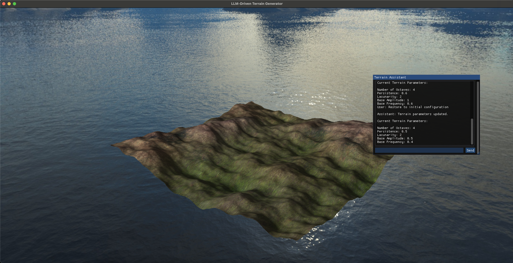

# AI-Assisted Procedural Terrain Generator

An advanced procedural terrain generation system built using C++ and OpenGL, featuring real-time terrain modification through natural language input powered by OpenAI's GPT-4 API.


## Table of Contents

- [Features](#features)
- [Demo](#demo)
- [Prerequisites](#prerequisites)
- [Installation](#installation)
- [Usage](#usage)
  - [Controls](#controls)
  - [Natural Language Interaction](#natural-language-interaction)
- [How It Works](#how-it-works)
- [Project Structure](#project-structure)
- [Dependencies](#dependencies)
- [Contributing](#contributing)
- [License](#license)
- [Acknowledgments](#acknowledgments)

---

## Features

- **Procedural Terrain Generation** using advanced Perlin noise algorithms
- **Real-Time Terrain Modification** via natural language commands
- **Integration with LLM** for interpreting user input and adjusting terrain parameters
- **Advanced Rendering Techniques**:
  - Normal Mapping for detailed surface textures
  - Reflective and Refractive Water Surfaces with dynamic wave animations
  - Skybox Implementation for immersive backgrounds
  - Phong Lighting Model for realistic illumination
- **Arcball Camera System** for intuitive navigation and exploration

---

## Demo

[](https://www.youtube.com/watch?v=your-demo-video-link)

*Click the image above to watch the demo video.*

---

## Prerequisites

- **Operating System**: Linux, macOS, or Windows
- **C++ Compiler**: GCC or Clang supporting C++11 or higher
- **Graphics Libraries**:
  - OpenGL
  - GLFW
  - GLEW
  - GLM
- **Networking Libraries**:
  - libcurl
- **JSON Library**:
  - nlohmann/json
- **OpenAI API Key**: Required for LLM integration

---

## Installation

### 1. Clone the Repository

```bash
git clone https://github.com/your-username/terrainmaster.git
cd terrainmaster
```

### 2. Install Dependencies

#### On Ubuntu/Debian

```bash
sudo apt-get update
sudo apt-get install build-essential cmake libglfw3-dev libglew-dev libglm-dev libcurl4-openssl-dev
```

#### On macOS

```bash
brew update
brew install cmake glfw glew glm curl
```

#### Install nlohmann/json

You can install it via a package manager or include the single-header library.

```bash
# Using vcpkg
vcpkg install nlohmann-json

# Or include manually
# Download json.hpp from https://github.com/nlohmann/json/releases
# Place it in the 'include' directory
```

### 3. Setup OpenAI API Key

Obtain your API Key from OpenAI

set the ```OpenAI_API_KEY``` environment variable:

```bash
export OPENAI_API_KEY="your-api-key-here"
```

### 3. Build the Project

Obtain your API Key from OpenAI

Create a ```Build``` directory and compile the project using CMake:

```bash
mkdir build
cd build
cmake ..
make
```

## Usage

### Run the Application

From the ```Build``` directory:

```bash
./OpenGLProject
```

### Controls

* **Camera Navigation:**

    * **Rotate:** Left-click and drag
    * **Zoom:** Scroll wheel
    * **Pan:** Right-click and drag
* **Modify Terrain:**
    * **Enter Modification Mode:** Press the ```M``` key
    * **Submit Command:** Type your command on terminal and ```press``` Enter

## Natural Language Interaction

While in modification mode, you can type commands to alter the terrain. Examples:

* "Increase the terrain detail slightly."
* "Make the mountains taller and the landscape rougher."
* "I want a smoother terrain with gentle hills."
* "Decrease the frequency of features for broader landscapes."

## How It Works

### Terrain Generation

The terrain is generated using Perlin noise, with parameters controlling various aspects:

* ```numOctaves```: Number of noise layers; higher values add detail
* ```persistence```: Amplitude decay; lower values create smoother terrain.
* ```lacunarity```: Frequency increase; higher values make features denser.
* ```baseAmplitude```: Overall height variation; higher values create taller hills.
* ```baseFrequency```: Scale of terrain features; higher values make features smaller and more frequent.

### LLM Integration

* **Function Calling:** The application uses LLM's function calling feature to interpret natural language commands and map them to terrain parameters.
* **System Prompt:** A custom prompt guides LLM to adjust parameters moderately unless significant changes are specified.
* **Parameter Constraints:** The application enforces constraints to prevent drastic changes and ensure smooth transitions.

## Project Structure

_Will update soon!_

## Dependencies

* **OpenGL:** Graphics rendering
* **GLFW:** Window and input handling
* **GLEW:** OpenGL extension management
* **GLM:** Mathematics library for graphics
* **libcurl:** HTTP requests for API interaction
* **nlohmann/json:** JSON parsing and serialization
* **LLM API:** Currently integrated OpenAI's GPT-4 (Feel free to use other available APIs)

## Contributing

Contributions are what makes the open-source community such an amazing place to learn, inspire, and create. Any contributions you make are **greatly appreciated**.

If you have a suggestion that would make this better, please fork the repo and create a pull request. You can also simply open an issue with the tag "enhancement".
Don't forget to give the project a star! Thanks again!

1. Fork the Project
2. Create your Feature Branch (`git checkout -b feature/AmazingFeature`)
3. Commit your Changes (`git commit -m 'Add some AmazingFeature'`)
4. Push to the Branch (`git push origin feature/AmazingFeature`)
5. Open a Pull Request

## License

This project is licensed under the GNU General Public License v3.0 License. See `LICENSE.txt` for more details.

## Acknowledgments

[Learn OpenGL by Joey de Vries](https://learnopengl.com/Introduction)

[OpenAI](https://openai.com/)

Feel free to reach out if you have any questions or suggestions!

_Happy terrain crafting!_
